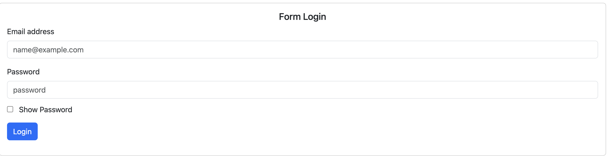
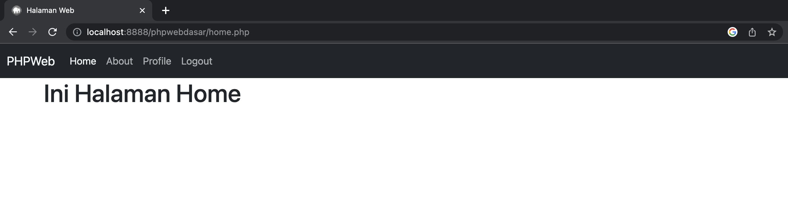

# PHPWeb

## Halaman Login.php
Halaman login untuk melakukan authentikasi dan verifikasi user yang login

```
    <?php

include "header.php";

?>

<div class="container">
   
    <div class="row align-items-center mt-4">
        <div class="col-lg-12">
            <div class="card">
                <div class="card-body">
                    <h5 class="card-title text-center">Form Login</h5>
                 
                    <form action="" method="post">

                    <div class="mb-3">
                        <label for="exampleFormControlInput1" class="form-label">Email address</label>
                        <input type="email" name="email" class="form-control" id="email" placeholder="name@example.com" required="true" autocomplete="off">
                    </div>
                    <div class="mb-3">
                        <label for="exampleFormControlInput1" class="form-label">Password</label>
                        <input type="password" name="password" class="form-control" id="password" placeholder="password" required="true">
                        <input type="checkbox" class="mt-3" onclick="myFunction()"/> &nbsp; Show Password
                    </div>
                    <div class="mb-3">
                       <button class="btn btn-primary" name="submit" type="submit">Login</button>
                    </div>
                    
                 </form>

                </div>
            </div>
        </div>
    </div>

    <?php 
          
        //   
                if(isset($_POST['submit'])){
                //    perintah dibawah untuk membuat session 
                    session_start();
                    // encrypt password kita
                    $username = $_POST['email'];
                    $password = $_POST['password'];
                    // if else
                    
                    if($username =="admin@admin.com" && $password==123){
                        // $_SESSION['user'] = variable session untuk menyimpan data user
                        $_SESSION['user']='admin';
                        // redirect ke halaman home jika berhasil
                        header('Location: home.php');

                    }else{
                        echo "<script>
                            alert('Gagal')
                        </script>";
                    }
                   
                    // username =admin & password 
                    // notifikasi berhasil login
                    // gagal
                    
                }
    ?>

</div>

<script>

    function myFunction(){
        var x = document.getElementById('password')
        if(x.type ==="password"){
            x.type = "text";
        }else{
            x.type ="password";
        }
     }
</script>
```
Output :


## Halaman Home.php
Setelah berhasil login, akan di arahkan ke halaman dashboard atau home

```
<?php 
   //membuat session awal wajib pakai session_start()
   session_start();
//    jika tidak ada variable session user maka kembalikan ke halaman login
   if(!isset($_SESSION['user'])){
        header('Location: login.php');

   }

   include "header.php";
   include "nav.php";

?>
<div class="container">
    <h1>Ini Halaman Home</h1>
</div>
```
Output:
